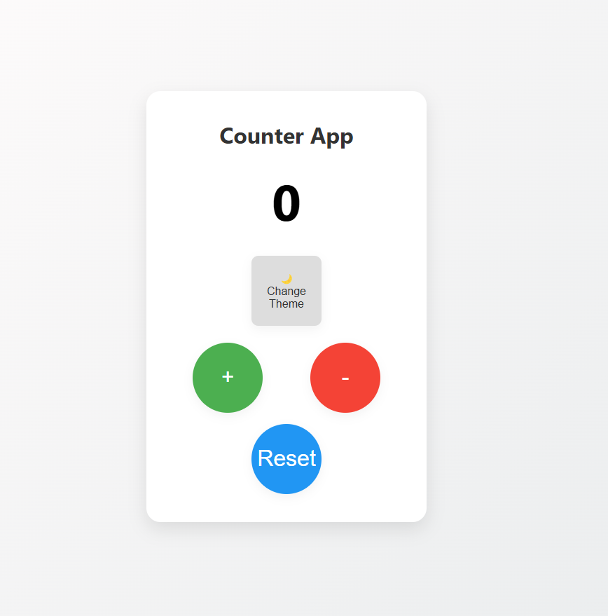

# ⏱️ Counter App

Bu proje, HTML, CSS ve JavaScript kullanılarak yapılmış basit bir sayaç uygulamasıdır.  
Kullanıcı sayacı artırabilir, azaltabilir veya sıfırlayabilir.  
Ayrıca uygulama tema seçici (Dark/Light Mode) desteğiyle birlikte gelir ve localStorage ile verileri saklar.

---

## 🚀 Özellikler

- ✅ Artır / Azalt / Sıfırla fonksiyonları
- 🎨 Tema değiştirici (Dark / Light Mode)
- 💾 localStorage ile kalıcı veri saklama
- 🎬 Animasyonlu sayısal geçiş
- 📱 Mobil uyumlu tasarım (responsive)

---

## Ekran Görüntüsü

---
