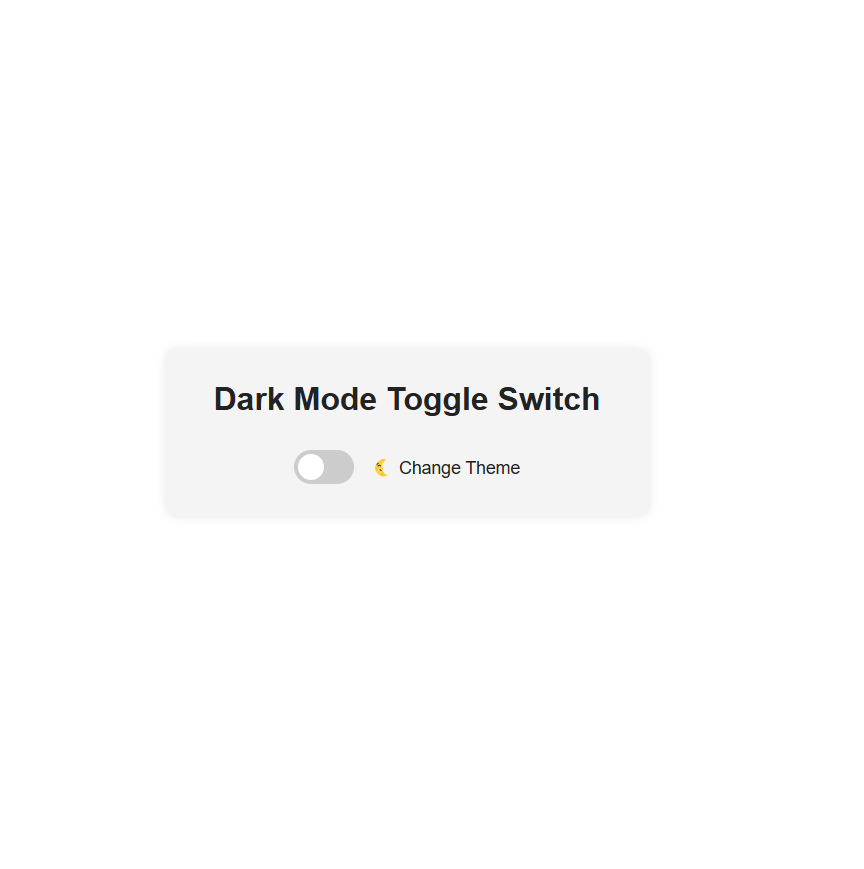

# 🌗 Dark Mode Toggle Switch

Bu proje, modern web siteleri için sade ve estetik bir **Dark Mode (Karanlık Tema)** geçiş uygulamasıdır.  
Tema değişimi, klasik buton yerine **toggle switch (anahtar)** ile yapılmaktadır ve kullanıcının tercihi **localStorage** aracılığıyla kaydedilir.

---

## 🎯 Özellikler

- ✅ Toggle switch ile tema geçişi
- 🌙 Karanlık / 🌞 Aydınlık modlar
- 💾 localStorage ile tercih kaydı
- 🧠 Sistem temasını algılama (ilk yüklemede)
- 🎨 Geçiş animasyonu & şık tasarım
- 📱 Tam mobil uyumlu (responsive)

---

