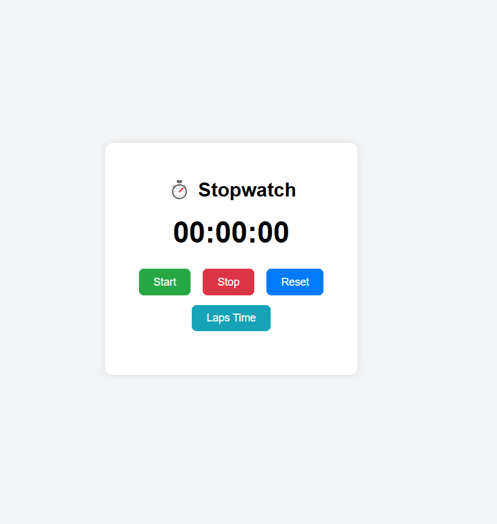

# ⏱️ Stopwatch Kronometre Uygulaması

Bu proje, JavaScript kullanılarak geliştirilen bir **kronometre uygulamasıdır**.  
Kullanıcılar zamanı başlatabilir, durdurabilir, sıfırlayabilir ve **tur ekleyebilir**.  

---

## 🎯 Özellikler

- ✅ Başlat / Durdur / Sıfırla
- 🏁 Tur (Lap) ekleme özelliği
- 🎵 Ses efektleri (opsiyonel)
- 🧠 `setInterval`, `clearInterval`, zaman hesaplama
- 💾 Temiz ve mobil uyumlu tasarım (responsive)
- 🎨 Dark Mode desteğine uygun hale getirilebilir

---

